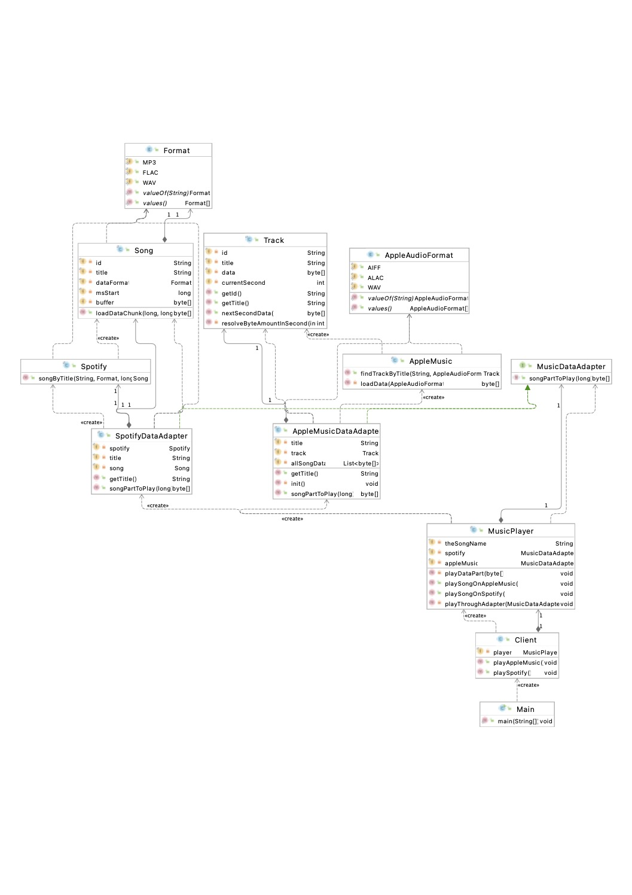

# Adapter
_Target, Client, Adaptee, Adapter._

We have a [MusicPlayer](kozlyuk/structural/adapter/music/webplayer/MusicPlayer.java) _(Target)_, which can iterate over a song data to actually play it on end user device.

_Adaptee's:_ 
* [AppleMusic](kozlyuk/structural/adapter/music/applemusic/AppleMusic.java)
* [Spotify](kozlyuk/structural/adapter/music/spotify/Spotify.java)

AppleMusic API only allows to download all song data. Spotify can retrieve song by parts.

Adptee's services provide different interfaces to song data.
[MusicDataAdapter](kozlyuk/structural/adapter/music/webplayer/dataadapter/MusicDataAdapter.java) is our target interface for player, it's implemented by adapters:
* [AppleMusicDataAdapter](kozlyuk/structural/adapter/music/webplayer/dataadapter/AppleMusicDataAdapter.java)
* [SpotifyDataAdapter](kozlyuk/structural/adapter/music/webplayer/dataadapter/SpotifyDataAdapter.java)

### UML
