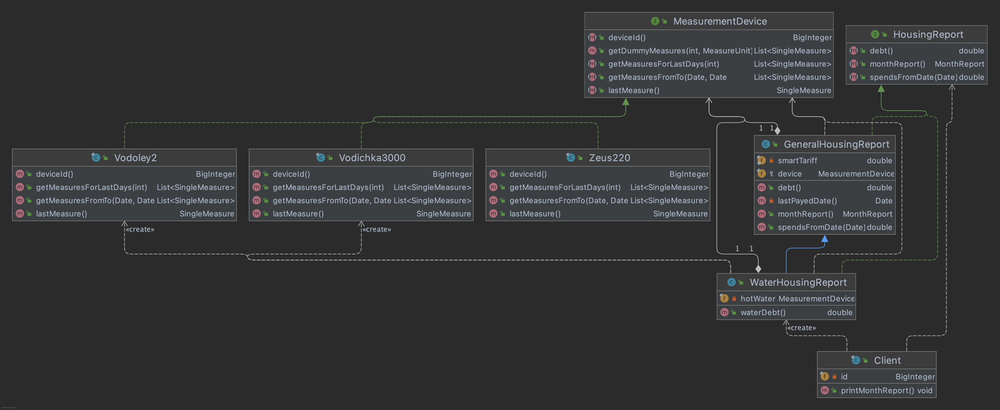

# Bridge
_Abstraction, Refined abstraction, Implementor, Concrete implementor_

Housing measurements service, which allows clients to get report regarding their water, heat and electricity consumption.

Abstractions - [HousingReport](./housingservice/report/HousingReport.java). Return client spends report for arbitrary period. 

Refined abstractions - [WaterReport](./housingservice/report/WaterHousingReport.java), ElectricityReport, GeneralHouseNeedsReport - domain specific reports.

Implementor - general [interface](./housingservice/measuredevice/MeasurementDevice.java) for measurement devices, based on different hardware platforms. Accessing info about device measurements in db.

Concrete implementor - implements interaction with concrete measurement device.

### UML
