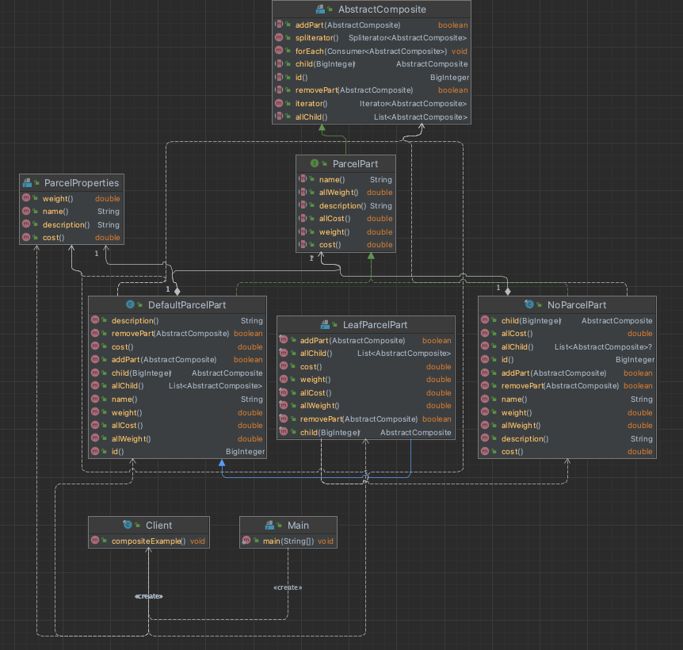

# Composite
_Component, leaf, composite, client_

Composite of complex parcel, which is tree structure of parcel parts containing each others. Each can be weight, described and evaluated.

Component -  [ParcelPart](./deviceparts/ParcelPart.java). The general interface for any parcel or it parts.

Leaf - [LeafParcelPart](./deviceparts/LeafParcelPart.java). 

Composite - [DefaultParcelPart](./deviceparts/DefaultParcelPart.java).

### UML
