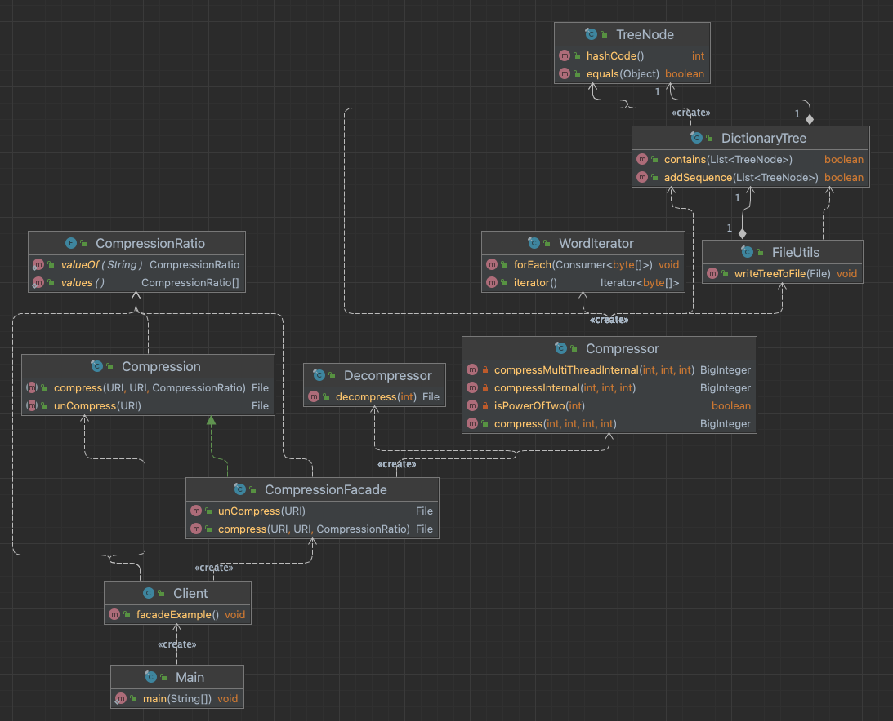

#Facade

Facade example of file compression library. 
Hides complex structures and parameters of compressing subsystem, provides a simple [interface](Compression.java). 

Facade - [CompressionFacade](./CompressionFacade.java) 

Subsystem classes - [lzcompress dirrectory](./lzcompress) 

# UML

