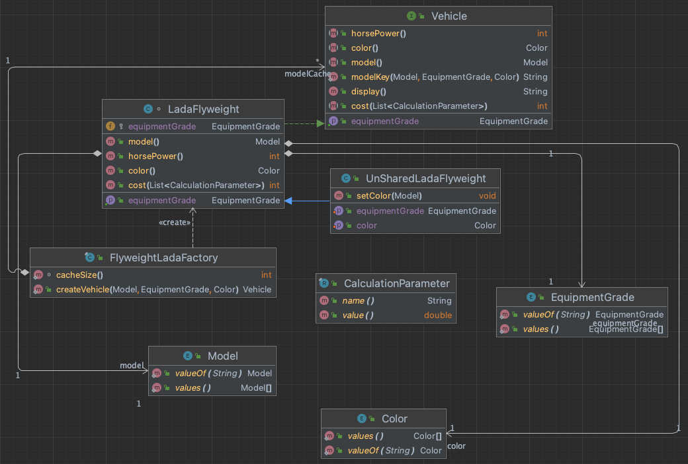

#Flyweight

Flyweight example for vehicle factory. It produces moderate amount of models, so the object producing in program can be optimized.  

FlyweightFactory - [FlyweightLadaFactory](./lada/FlyweightLadaFactory.java) 

FlyWeight - [Vehicle](./lada/Vehicle.java)

ConcreteFlyWeight - [LadaFlyweight](./lada/LadaFlyweight.java)

# UML

