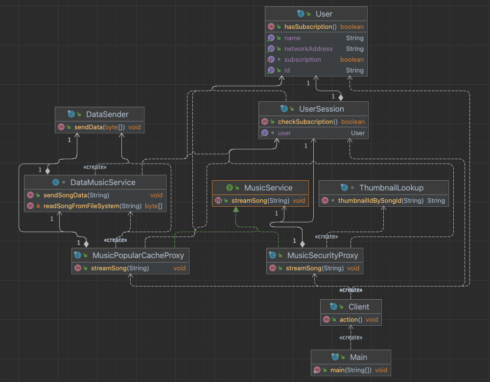

#Proxy

Music service example with 2 proxy's'.

[Subject](./music/MusicService.java) - music streaming interface
[RealSubject](./music/DataMusicService.java) - can send song for real
Proxy's:
* [subscription checking](./music/MusicSecurityProxy.java), if not present streams thumbnail
* [popular music cache](./music/MusicPopularCacheProxy.java)

# UML

